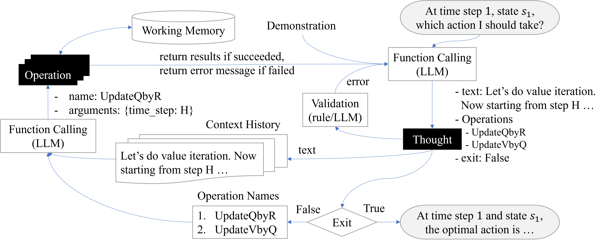

# STRIDE: A Tool-Assisted LLM Agent Framework for Strategic and Interactive Decision-Making

This repository contains implementation of [STRIDE: A Tool-Assisted LLM Agent Framework for Strategic and Interactive Decision-Making](https://arxiv.org/abs/2405.16376).

This is achieved by equipping LLMs with a set of operational tools specially designed to take care of low-level calculations of the decision-making problem of interest and then instructing the LLM to generate a structured Thought sequence that utilizes these operational tools to emulate various algorithmic behaviors to optimally solve the problem. 
For example, the figure below illustrates how STRIDE emulates the Value Iteration Algorithm to compute the optimal policy of an MDP.



## Environments
We have implemented the following environments to evaluate STRIDE.
- **Tabular MDP**
    - Tabular MDP with known model: STRIDE emulates Value Iteration Algorithm to compute the optimal policy.
    - Taubular MDP with unknown model: STRIDE emulates Upper Confidence Bound Value Iteration Algorithm to strategically explore the unknown environment.
- **Dynamic Mechanism Design**
    - STRIDE emulates a dynamic programming algorithm to compute the policy and pricing of VCG mechanism.
- **Bargaining Games**
    - Alternating offer bargaining with complete information: STRIDE emulates a backward induction algorithm to compute the Subgame Perfect Equilibrium.
    - Bargaining with onesided uncertainty: STRIDE emulates an algorithm combining bisection search and backward induction to compute the Sequential Equilibrium.

## Instructions

### How to run
Execute `run.py` to run STRIDE on different environments. For example,
```
python run.py --env tabular_mdp --mdp_known True --agent_engine gpt-4o
```
Then STRIDE agent, which is defined in `agents\StriDe.py`, will play the `tabular_mdp` environment defined in `envs\tabular_mdp.py`. As `--mdp_known` is set to `True`, StriDe will read the demonstration file `envs\tabular_mdp\prompts\tabular_mdp_vi_exmps.txt` to emulate Value Iteration Algorithm to compute the optimal policy of the given MDP. The tools used for emulating both Value Iteration and Upper Confidence Bound Value Iteration are defined in `envs\tabular_mdp\tools.py`.

### Generate new demonstration
To generate a new demonstration for a specific environment, execute `generate_examples.py` in the corresponding folder, which produces a new `txt` file under `\prompts`.

### Prepare STRIDE to emulate new algorithms
Follow the following procedure
- create a new folder under `\envs` and define the environment in `env.py`;
- define the operational tools in `tools.py`, where each tool is a `BaseModel` object of [Pydantic](https://docs.pydantic.dev/latest/) package;
- implement the reference algorithm (the algorithm that we want STRIDE to emulate) in `program_agent.py` using the defined tools, and augment it with comments that explain the algorithm logic and tool calls;
- run the implemented algorithm on the defined environment using `generate_examples.py`, which saves the demonstration as a `txt` file.

Then by providing STRIDE with the generated demonstration file and the operational tools, it will be able to emulate the reference algorithm in its reasoning process.
